# VLN-VERSE 다음 행동 예측 — 딥러닝 Week 4·5 최종 보고서

> 팀 오족보행 · Qwen3-VL-2B LoRA 기반 자연어 내비게이션

VLN-VERSE 다음 행동 예측

딥러닝 텀프로젝트 — Week 4·5 최종 발표

Qwen3-VL-2B LoRA 기반 자연어 내비게이션


팀 오족보행

팀원   박성현 · 김주영 · 한준태 · 변민석

## 0. AI 활용 — 요청 프롬프트와 그 활용 방식

우리 팀은 VLN(Vision-Language Navigation)을 이번 과제로 처음 접했습니다. 비전 인코더의 출력이 어떻게 언어 모델 입력으로 들어가 길안내가 되는지, LoRA가 무엇을 학습하는지부터 잘 잡히지 않아, 첫날은 코드를 돌리기보다 구조를 이해하는 데 거의 다 썼습니다. 그래서 AI(Claude)에 개념을 질문하고, 우리가 내린 결정이 타당한지 되묻는 방식으로 작업을 진행했습니다. 주고받은 프롬프트와 답변 전문은 보고서와 함께 .md로 공개합니다(AI_대화기록.md).

활용은 개념 학습에서 시작했습니다. VLN/VLM/VLA의 차이, Qwen3-VL이 이미지를 시각 토큰으로 바꿔 언어 모델에 넣는 구조 등을 문답으로 익혔습니다. 그다음 과제 명세를 직접 정리해 학습 계획과 점검 항목을 함께 짰습니다. 가장 도움이 된 것은 데이터를 직접 열어 본 단계였습니다. parquet과 rgb.npy를 확인해 보니 전진이 67%인데 정지는 2%뿐인 심한 불균형이 드러났고, 이것이 이후 설계의 출발점이 됐습니다. 또한 4시간이 넘는 본학습을 바로 돌리기 전에, 파이프라인이 중간에 멈추지 않는지 자동으로 점검하는 사전 검증과 작은 규모로 후보를 빠르게 비교하는 소규모 실험 구조를 먼저 만들어 두고 본학습에 들어갔습니다.

다만 AI의 답을 그대로 받아쓰지는 않았습니다. 균형 전략, LoRA를 붙일 위치, 평가지표 선택 같은 결정은 질문하고 작은 실험으로 확인한 뒤에 채택했습니다. 중간 점검에서 offline 정확도만 보고 있고 정작 closed-loop 성공률(SR)은 한 번도 측정하지 않았다는 점을 뒤늦게 깨달아, 평가 순서를 SR 측정 우선으로 다시 잡기도 했습니다.

## 1. 시스템 아키텍처 (레이어별 입출력)

베이스 모델은 이미지와 텍스트를 함께 처리하는 멀티모달 모델 Qwen3-VL-2B-Instruct입니다. 이미지는 비전 인코더(ViT)를 거쳐 '시각 토큰'으로 바뀌고, 이 시각 토큰을 지시문 텍스트와 한 줄로 이어 붙여 언어 모델에 함께 넣습니다. 언어 모델은 이미지와 텍스트가 섞인 전체 입력을 한 번에 읽어 다음 행동 문자열을 생성합니다. LoRA 어댑터는 언어 모델 어텐션의 q_proj와 v_proj에만 붙이고, 비전 인코더와 나머지 가중치는 모두 동결했습니다.

그림 1-1. 전체 흐름 — 입력(이미지·텍스트) → 시각 토큰 결합 → Qwen3-VL 디코더 → 행동 (두 모델 공통 백본)

```
[I_{t-1}, I_t] 2×(3,256,256) ─► (preprocess) pixel_values (512,1536)
                                   │
                  Vision Encoder(ViT, frozen, 24L) + 2×2 spatial merge
                                   │  → vision embeds (128, 2048)  (64 tok/img × 2)
instruction+system text ─► tokenizer ─► input_ids (1,226) ─► token embed → (1,226,2048)
                                   │  (이미지 placeholder 128칸에 vision embeds 주입)
                                   ▼
                  inputs_embeds (1, 226, 2048)
                                   │
    Qwen3-VL LM decoder × 28층  (각 self-attn q_proj·v_proj 에 LoRA, 그 외 frozen)
                                   │  → (1, 226, 2048)
                  final RMSNorm → LM head (2048 → 151936)
                                   │
                       logits (1, 226, 151936)
                                   │
          정답 action token(+EOS) 위치에만 CE loss   (나머지 label = -100)
```

입력 이미지 2장(256×256), 배치 B를 기준으로 한 주요 레이어의 텐서 형태는 다음과 같습니다. 이 구조는 두 모델이 동일하게 사용합니다.

| 단계 | 입력 형태 | 출력 형태 |
| --- | --- | --- |
| 이미지 입력 | [B, 2, 3, 256, 256] | — |
| ViT patch embed | [B, 2·256, 1152] | patch 토큰 |
| 2×2 patch merger + projector | [B, 128, 1152] | [B, 128, 2048] |
| 텍스트 임베딩 | [B, L_text] | [B, L_text, 2048] |
| 이미지·텍스트 토큰 결합 | — | [B, L, 2048] |
| Qwen3 decoder (q/v LoRA) | [B, L, 2048] | [B, L, 2048] |
| LM head → 행동 생성 | [B, L, 2048] | "Turn right 15 degree" |

이미지 1장은 patch 16×16 → 256 patch, 2×2 병합으로 64 시각 토큰이 되어 2장이면 약 128 토큰이 됩니다(해상도에 따라 변동).

| 파라미터 | 값 |
| --- | --- |
| 전체 파라미터 | 2,130,743,296 (2.13B) |
| 학습 파라미터(LoRA) | 3,211,264 (0.15%) |
| 동결 | vision encoder · LM base · token embedding |

위 아키텍처·텐서 형태·파라미터는 두 모델 공통이며, 차이는 입력·학습 설정에 있습니다(아래).

언어 모델 세부: hidden D=2048, decoder 28층, attention 16 head(head_dim 128), KV는 GQA로 8 head(16 Q head가 8 KV를 공유), MLP intermediate 6144(SwiGLU), vocab 151,936. 비전 인코더는 hidden 1024·24층, patch 16·2×2 spatial merge로 이미지당 64 토큰을 만들어 2048로 투영합니다. LoRA는 28층의 q_proj·v_proj 56개 모듈에만 붙어 층당 114,688개(=3.21M)를 학습합니다.

1-2. 모델별 입력·구성

학습 실패 위험을 분산하기 위해 같은 백본을 두 갈래(모델1·모델2)로 나눠 병행 학습했습니다. 입력과 학습 방식에서만 차이를 두었습니다.

| 구분 | 모델1 | 모델2 |
| --- | --- | --- |
| 입력 | 이미지 2장 + 지시문 | 이미지 2장 + 지시문 |
| LoRA 적용 | q·v (용량 확장 실험 포함) | q·v |
| 핵심 전략 | LoRA 용량·입력 정보를 키워 정확도↑ | 전진에 쏠린 데이터를 회전·정지가 자주 나오게 재구성 |
| 학습량 | 3 epoch | 6 epoch (best: epoch 1) |

## 2. 학습 하이퍼파라미터

두 모델은 LoRA 구성과 최적화 설정 대부분을 공유하고, 데이터 구성(균형 재샘플링)·epoch 수·effective batch에서 차이가 있습니다(모델별 GPU가 달라 배치를 맞춤). 먼저 공통 설정입니다.

| 항목 | 값 | 항목 | 값 |
| --- | --- | --- | --- |
| base model | Qwen3-VL-2B-Instruct | LoRA target | q_proj, v_proj |
| LoRA r / alpha / dropout | 16 / 32 / 0.05 | optimizer | AdamW |
| learning rate | 1e-4 | scheduler / warmup | cosine / 0.03 |
| effective batch | 모델2 16(4×4) · 모델1 18(6×3) | precision / grad ckpt | bf16 / 사용 |
| max image / 해상도 | 2 / 256×256 | max text length | 별도 제한 없음(프로세서 기본) |
| 추론 | max_new_tokens=8, greedy, KV cache |  |  |

다음은 두 모델이 다르게 둔 설정입니다.

| 항목 | 모델1 | 모델2 |
| --- | --- | --- |
| epochs | 3 | 6 (best: epoch 1) |
| 데이터 구성 | 원본 분포 그대로 | 회전·정지를 더 자주 샘플링(balance_power 0.7) |
| epoch당 학습량 | 전량 | 175,000개(균형 샘플) |
| best 체크포인트 기준 | validation loss 최소 | macro 정확도 최대 |
| seed | 7 | 0 |

모델2의 balance_power 0.7은 전진(67%)에 쏠린 데이터를, 희귀한 회전·정지가 더 자주 등장하도록 재구성하는 강도입니다. 한 epoch에서 전진 약 66,000 · 좌·우회전 각 43,000 · 정지 23,000개를 학습해 회전·정지의 학습 기회를 늘립니다. 모델1은 재구성 없이 원본 분포로 3 epoch 학습했습니다(적정 epoch는 학습 전 별도 초기 탐색으로 정함 — §6 참조).

## 3. 데이터 분할 방법

데이터는 VLN-VERSE의 fine_train 전량(3,963 에피소드 · 195,484 샘플)을 사용했고, 프레임을 100% 추출해 학습에 넣었습니다. 분할은 에피소드 단위로 했습니다. 같은 에피소드의 앞뒤 프레임은 거의 비슷해서, 한 에피소드의 일부 프레임을 학습에 넣고 나머지를 검증에 넣으면 모델이 사실상 학습 때 본 장면으로 검증을 받아 점수가 부풀려집니다. 이런 '엿보기'를 막기 위해 한 에피소드는 통째로 학습 또는 검증 한쪽에만 넣었습니다. closed-loop 최종 평가용 fine_val은 학습에 사용하지 않았습니다.

| 구분 | 값 (공통) |
| --- | --- |
| 전체 에피소드 / 샘플 | 3,963 / 195,484 |
| 분할 단위 | 에피소드 단위 (한 에피소드는 학습·검증 중 한쪽에만) |
| 행동 분포 | 전진 67% · 좌 16% · 우 15% · 정지 2% |

검증셋은 두 모델이 분할 시드가 달라 크기가 다릅니다.

| 모델 | 분할 설정 | 검증 샘플 |
| --- | --- | --- |
| 모델1 | episode-level · seed 7 · val 비율 0.1 | 18,962 |
| 모델2 | episode-level · seed 0 | 19,708 (396 에피소드) |

6장의 모델1 수치는 모델1 기준 full-val(18,962)로 측정한 값입니다.

## 4. 학습 / 검증 손실 곡선

학습 중 train loss, validation loss, accuracy, learning rate, epoch을 Weights & Biases에 실시간 기록했습니다(모델2 run: https://wandb.ai/juyoung020-/week4-vln-qwen3vl/runs/tiyaqkyu). 아래 그래프는 모두 모델2(균형형) 본학습 기록입니다.

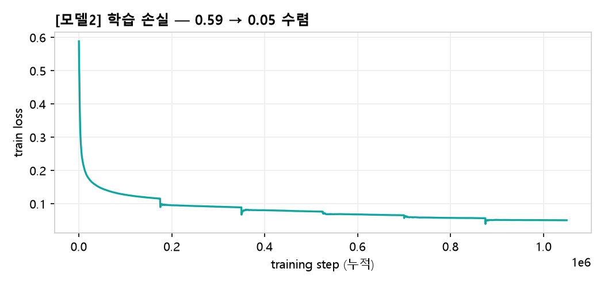

그림 4-1. [모델2] 학습 손실 (train loss) — 0.59에서 0.05 부근까지 수렴

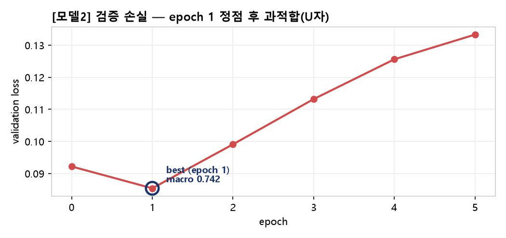

그림 4-2. [모델2] 검증 손실 (validation loss) — 0.092 → 0.085

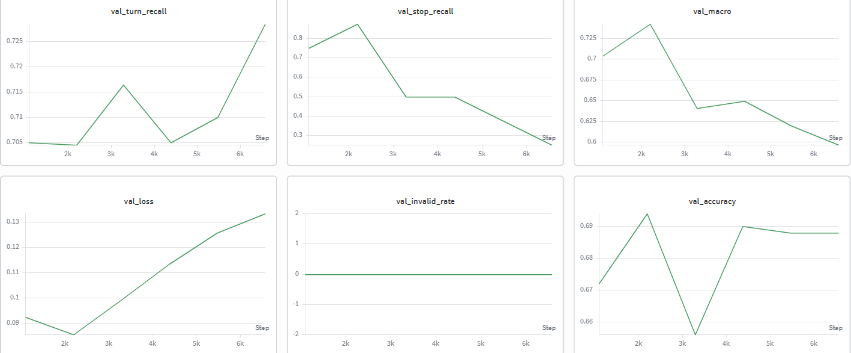

그림 4-3. 실제 W&B 화면 — 모델2 검증 지표(turn-recall · stop-recall · macro)

train loss는 0.59에서 0.05까지 꾸준히 내려가 수렴했습니다. epoch 경계마다 균형 재샘플링으로 데이터가 새로 구성되어 손실이 잠깐 튀었다가 다시 내려가는 패턴이 보이고, learning rate는 warmup 뒤 cosine으로 감소합니다.

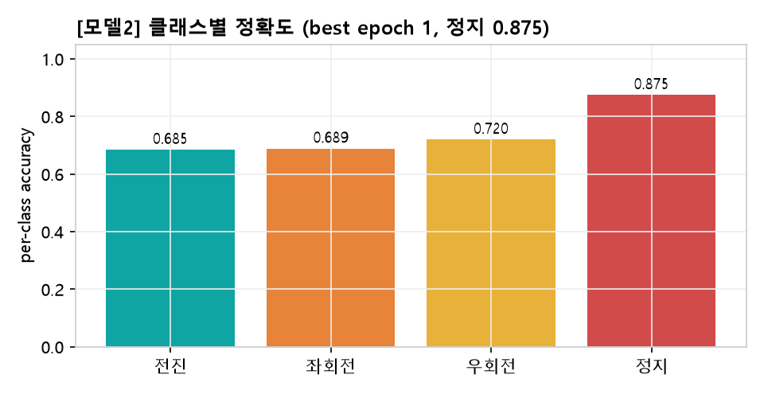

그림 4-4. [모델2] 클래스별 정확도 (best epoch 1, 정지 0.875)

검증 지표(학습 중 mini-val 500 기준)는 epoch 0→1에서 loss 0.092→0.085, overall 0.672→0.694, macro 0.704→0.742로 좋아졌고, 특히 정지(Stop)가 0.75→0.875로 크게 올라 epoch 1이 best였습니다. 그러나 epoch 2부터는 train loss가 계속 내려가는데도 validation loss가 0.099→0.113→0.126→0.133으로 다시 올라(macro 0.742→0.597) 과적합이 나타났습니다. 균형형 모델2도 모델1과 마찬가지로 '더 길게 ≠ 더 좋게'였으며, macro 최대 기준으로 epoch 1을 best로 저장했습니다(정지 0.875). invalid 출력은 전 구간 0%입니다.

## 5. Closed-loop 평가 (IsaacSim)

최종 평가는 IsaacSim에서 로봇을 실제로 주행시켜 수행했습니다. 지정된 train 20개 에피소드와 val_seen의 232개 에피소드(top-53 scans, timeout 40초)에 대해 SR, OSR, SPL, nDTW, Goal Distance와 invalid 출력률을 측정했습니다.


그림 5-1. IsaacSim closed-loop 주행 장면 — Go2 로봇의 1인칭 시점(이 화면이 매 스텝 모델의 입력이 됩니다)

모델1은 지정 평가셋 전체를 closed-loop로 측정했습니다(GUI 렌더, 성공반경 3m, timeout 40초, KV cache). 지정 20개(train 10 + val 10)와 val_seen 232개(53 scan) 결과입니다(과제 §14).

| 평가셋 (모델1) | n | SR | OSR | SPL | nDTW | Goal Dist | Invalid |
| --- | --- | --- | --- | --- | --- | --- | --- |
| Train 20-set | 10 | 0.50 | 0.60 | 0.283 | 0.519 | 4.46 m | 0% |
| Val 20-set | 10 | 0.20 | 0.40 | 0.184 | 0.525 | 5.72 m | 0% |
| 20-set 합계 | 20 | 0.35 | 0.50 | 0.234 | 0.522 | 5.09 m | 0% |
| Val_seen 232-set | 230* | 0.391 | 0.565 | 0.320 | 0.575 | 4.55 m | 0% |

*232개 중 2개(스폰 실패)는 제외해 230개 집계. 232-set이 20-set보다 오히려 더 좋아(SR 0.39 vs 0.35) 더 큰 평가셋에서도 일관되게 작동 — 단일 에피소드 운이 아니라 실제 내비게이션 능력을 학습했음을 뒷받침합니다. 추론 속도 평균 138 ms/action(KV cache, n=2,230).

ablation 모델(all-linear)도 동일 20-set으로 재평가했고, offline에서 macro가 더 높았던 모델이 closed-loop에서도 일관되게 우위였습니다 — offline 개선이 실제 주행으로 전이됨을 뒷받침합니다.

| 모델 (20-set, n=20) | SR | OSR | SPL | nDTW | Goal Dist |
| --- | --- | --- | --- | --- | --- |
| baseline (q·v, 3.2M) | 0.35 | 0.50 | 0.234 | 0.522 | 5.09 m |
| all-linear (17.4M) | 0.45 | 0.70 | 0.377 | 0.649 | 4.51 m |

all-linear가 모든 지표에서 우위(SR +10%p, OSR +20%p, SPL·nDTW도 큰 폭↑).

모델2(best epoch 1)도 closed-loop로 측정했습니다. 특히 모델1이 실패했던 바로 그 에피소드 kujiale_0010_4_4에서, 모델2는 목표 앞에서 정지에 성공했습니다 — offline 정지 정확도(0.366→0.875)의 개선이 실제 주행으로 그대로 이어진 결과입니다.

| kujiale_0010_4_4 | SR | OSR | SPL | nDTW | Goal Dist |
| --- | --- | --- | --- | --- | --- |
| 모델1 baseline | 0 | 1 | 0 | 0.464 | 6.63 m (지나침) |
| 모델2 best | 1 | 1 | 1.000 | 0.904 | 1.12 m (정지 성공) |

같은 에피소드에서 모델1은 목표를 지나쳐 6.63m 이탈(SR=0), 모델2는 1.12m 앞에 정지(SR=1). 균형형의 정지 학습이 '목표 앞 정지'로 직결됨을 실측으로 확인.

모델2의 20-set closed-loop(kujiale_0010 · fine 10 + coarse 10)도 동일 설정으로 측정했습니다. 18개를 정상 측정했고, 2개는 시뮬 프로세스 타임아웃으로 집계에서 제외했습니다.

| 평가셋 (모델2 best) | n | SR | OSR | SPL | nDTW | Goal Dist |
| --- | --- | --- | --- | --- | --- | --- |
| 20-set (kujiale_0010) | 18 | 0.50 | 0.50 | 0.470 | 0.569 | 4.47 m |

9/18 성공. 모델1의 공식 20-set(SR 0.35, 다중 scan)과는 평가 씬이 달라(모델2는 kujiale_0010 단일 scan) 직접 비교엔 주의가 필요합니다. 다만 같은 에피소드 kujiale_0010_4_4에서는 모델1 SR 0 → 모델2 SR 1로 명확히 개선됐고, 모델2는 실패 시에도 OSR=SR(목표 도달 자체를 못 함)로 모델1의 '근접 후 정지 실패(OSR>SR)'와는 다른 양상을 보였습니다.

## 6. Ablation 결과

회전과 정지를 잘 못하는 문제의 원인을 좁히기 위해 두 모델이 서로 다른 축을 실험했습니다. 모델2는 클래스 불균형 자체를 다뤘고, 모델1은 입력 정보·LoRA 용량·학습량을 다뤘습니다.

### 6-A. balance_power 강도별 비교 (모델2)

데이터 재구성 강도(balance_power)를 0.0부터 1.0까지 바꿔 가며 회전과 전진의 정확도가 어떻게 변하는지 살펴봤습니다.

| balance_power | turn-recall | forward-recall | macro | 관찰 |
| --- | --- | --- | --- | --- |
| 0.0 (자연 분포) | 0.03 | 0.99 | 0.26 | 회전을 거의 못 함 |
| 0.5 (sqrt) | 0.26 | 0.43 | 0.24 | 출발점 |
| 0.75 | 0.38 | 0.21 | 0.24 | 회전 개선 |
| 1.0 (완전 균형) | 0.56 | 0.02 | 0.28 | 과회전·직진 붕괴 |

초경량 스모크 결과라 절대값보다 경향을 봅니다. always-forward 기준선은 turn 0.00 / forward 1.00 / macro 0.25입니다.

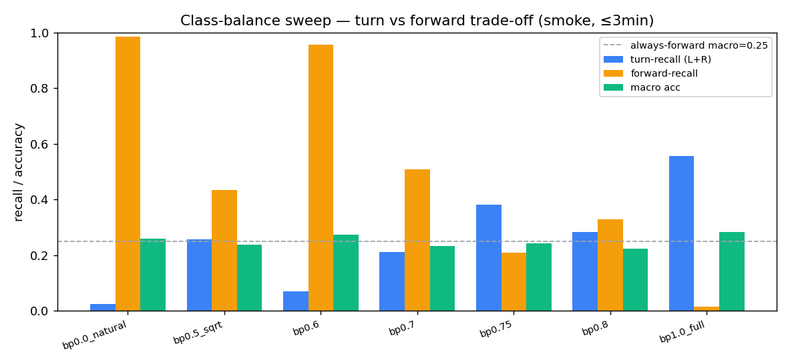

그림 6-1. balance_power에 따른 turn-recall과 forward-recall의 trade-off

균형을 올릴수록 회전 능력은 단조롭게 좋아지지만 전진 능력은 무너지는 trade-off가 확인됐습니다. 완전 균형(1.0)은 제자리에서 도는 부작용이 있어, 두 능력이 모두 살아 있는 중간값(0.7)을 본학습 설정으로 골랐습니다. 실제로 0.7로 전체 데이터를 학습하자 검증 macro가 epoch 0에서 0.704, epoch 1에서 0.742로 올랐고, 정지 정확도는 0.75에서 0.875까지 개선됐습니다.

다만 회전·정지 비중을 늘린 대가로 일반화가 훨씬 일찍 포화됐습니다 — 원본 baseline은 epoch 4가 정점이었지만(초기 탐색), 재구성한 모델2는 epoch 1에서 정점을 찍고 곧장 과적합으로 돌아섰습니다(상세 곡선·수치는 §4). 소수 클래스를 빨리 외우게 한 만큼 과적합도 빨라진 셈입니다.

### 6-B. 정보 · 용량 ablation (모델1, full val 18,962)

모델1은 같은 baseline에서 두 가지(입력 정보·LoRA 용량)를 바꿔 '무엇이 어떤 약점을 고치는지'를 분리했습니다.

첫째, 과거 행적과 상대 위치를 텍스트로 덧붙인 trajectory-aware 설정에서는 진행도 판단이 필요한 정지가 가장 크게 개선됐습니다.

| 지표 | baseline | +trajectory | 차이 |
| --- | --- | --- | --- |
| overall | 74.79% | 75.20% | +0.41 |
| Stop | 36.6% | 41.9% | +5.3 |
| macro(4클래스) | 55.7% | 57.8% | +2.1 |

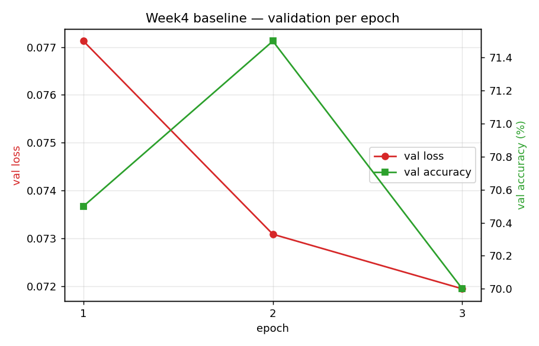

그림 6-2. [모델1] trajectory-aware 검증 곡선

둘째, LoRA를 q/v(3.2M)에서 전체 linear 층(17.4M)으로 확장하자 회전이 크게 좋아져 macro가 59.0%로 가장 높았습니다. 다만 표현력이 늘면서 과적합이 더 일찍 시작됐습니다.

| 지표 | baseline (q,v) | all-linear |
| --- | --- | --- |
| trainable | 3.2M (0.15%) | 17.4M (0.81%) |
| overall acc | 74.79% | 75.39% |
| Turn left / right | 52.1 / 46.1% | 61.9 / 51.1% |
| Stop | 36.6% | 37.6% |
| macro | 55.7% | 59.0% |

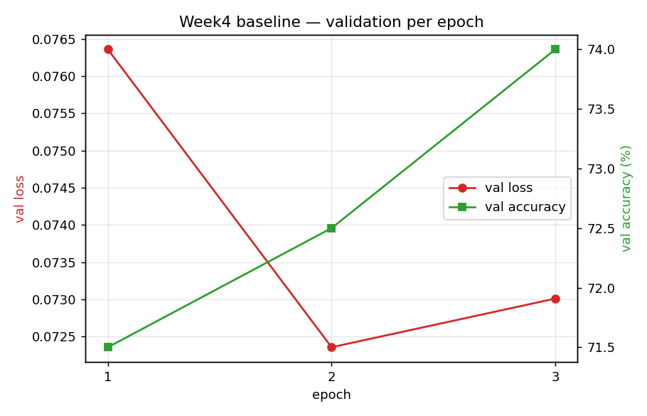

그림 6-3. [모델1] all-linear LoRA 검증 곡선

한편 적정 epoch 수는 본학습 전 별도 초기 탐색으로 정했습니다. baseline을 9 epoch까지 돌려보니 validation loss가 epoch 4에서 0.0736으로 최저를 찍은 뒤 다시 오르는 U자 곡선(과적합)이 나타났습니다. train loss는 계속 내려가므로 이는 과적합이며, 3~4 epoch가 최적이고 그 이상은 손해라는 결론을 얻어 모델1은 3, 모델2는 6 epoch로 짧게 잡았습니다.

| epoch | 1 | 3 | 4(best) | 6 | 9 |
| --- | --- | --- | --- | --- | --- |
| val_loss | 0.0803 | 0.0742 | 0.0736 | 0.0771 | 0.1036 |

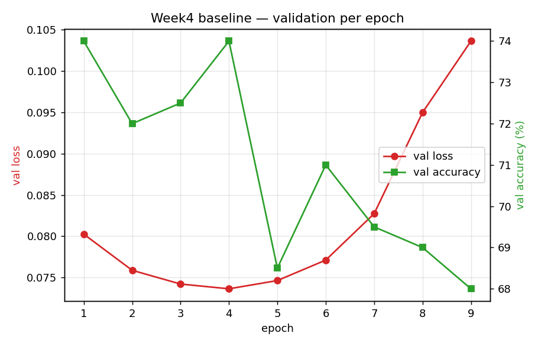

그림 6-4. 초기 탐색 · 9-epoch validation loss U자 곡선(과적합) — 적정 epoch 결정 근거

정리하면 전진과 좌회전을 헷갈리는 문제는 표현력(용량)의 문제였고, 정지 약점은 정보(부분 관찰)의 문제로 원인이 갈렸습니다.

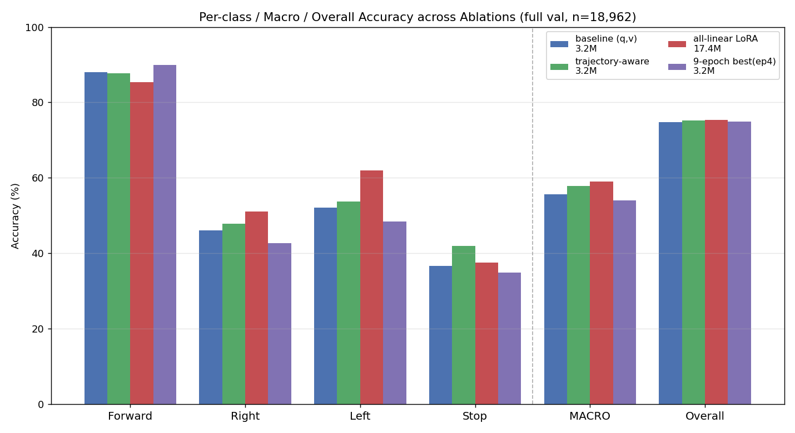

그림 6-5. [모델1] 4개 모델의 클래스별·macro·overall 정확도 — overall은 모두 ~75%로 평평하나 회전·Stop·macro에서 차이가 뚜렷

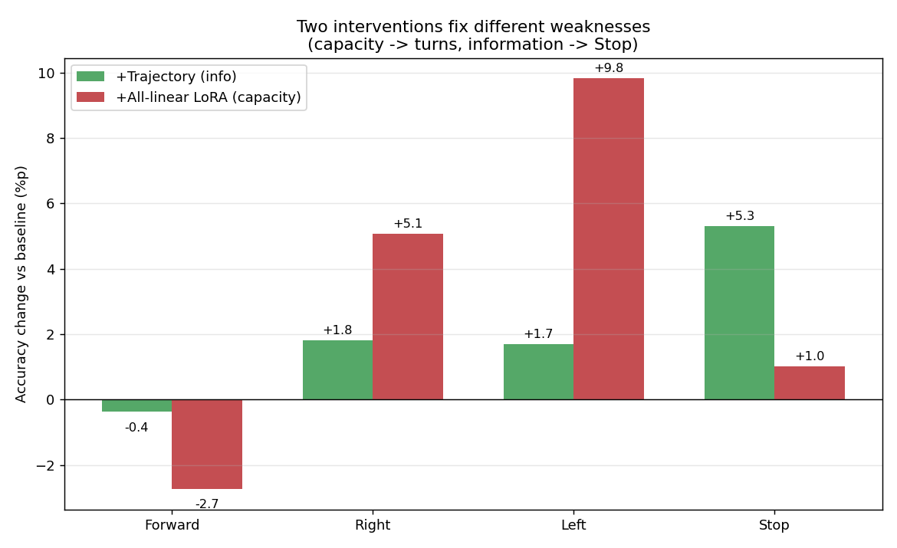

그림 6-6. [모델1] 두 개입이 고치는 약점이 다르다 — baseline 대비 변화량(%p). 정보(trajectory)는 Stop만, 용량(all-linear)은 좌·우 회전을 끌어올림

### 6-C. 두 모델 비교 (모델1 · 모델2)

같은 코드베이스에서 출발했지만 전략이 달라 서로 보완되는 결과가 나왔습니다.

| 관점 | 모델1 (full-val 18,962) | 모델2 (mini-val 500, 잠정) |
| --- | --- | --- |
| 핵심 전략 | baseline + 정보·용량·학습량 ablation | 클래스 불균형 재샘플링(bp 0.7) |
| overall acc | 74.8% (전진 편향 유지) | 69.4% (전진 일부 양보) |
| macro(4클래스) | 55.7 → 59.0% | 74.2% |
| Stop recall | 36.6 → 41.9% | 75 → 87.5% |
| 학습 epoch / 과적합 | 3 epoch (과적합 전) | 6 중 epoch 1 정점(재배치로 일찍) |
| closed-loop SR | 0.35(20) · 0.39(232) 측정완료 | 0.50 (kujiale_0010, n=18) · 동일ep 0→1 |
| GPU / effective batch | RTX 4090 / 18 | RTX 5070 Ti / 16 |

⚠ 두 모델의 val 척도가 다릅니다 — 모델1은 full-val(18,962), 모델2는 mini-val(500) 잠정치(best epoch 1)입니다. 따라서 macro 59.0% vs 74.2%를 직접 비교하면 안 되며, 동일 full-val 재평가는 후속 과제로 남깁니다(수치 단위는 모두 %).

모델1은 overall 정확도를 끌어올리고 약점의 원인을 용량과 정보로 분해하는 데 강했고, 모델2는 정지·회전 같은 소수 클래스를 살리는 데 강했습니다. 접근은 달랐지만 둘 다 불균형 데이터에서는 overall이 다수 클래스에 가려지므로 macro와 클래스별 지표로 봐야 한다는 점을 확인했습니다.

## 7. Failure case 분석

가장 두드러진 실패는 offline 정확도는 정상인데 실제 주행에서는 직진만 하다 벽에 부딪히는 현상이었습니다. 원인을 다음과 같이 분석했습니다.

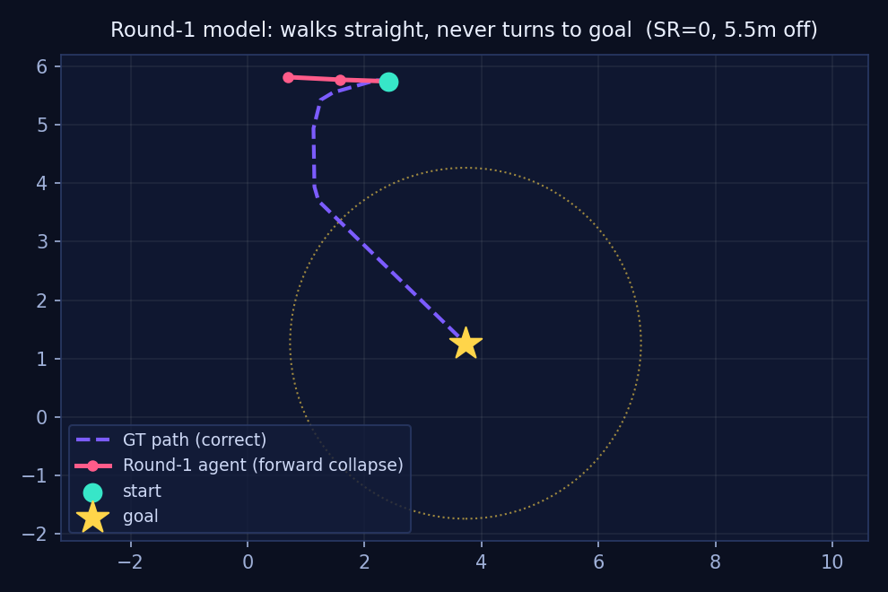

그림 7-1. 초기 모델의 직진 붕괴 궤적(목표를 지나쳐 직진)

첫째는 분포 시프트입니다. offline 평가는 전문가가 잘 간 길의 프레임으로 채점하지만, closed-loop에서는 로봇이 스스로 만든 불완전한 궤적의 낯선 프레임을 보게 됩니다. 이때 모델은 다수 행동인 전진으로 회귀하고, 그 실수가 다음 관찰을 바꾸며 오차가 누적됩니다. 둘째는 클래스 불균형으로, 전진과 정지의 비율이 약 32대 1이라 모델이 구조적으로 전진에 치우칩니다. 모델1의 full val 분석에서도 전진 88.1%, 정지 36.6%로 정지가 가장 약했고, 주된 오류는 전진과 좌회전을 맞바꾸는 혼동이었습니다. 한편 invalid 출력이 전진으로 대체되며 편향을 키우는지도 의심했으나, 로그상 invalid가 0건이어서 이 가설은 기각했습니다.

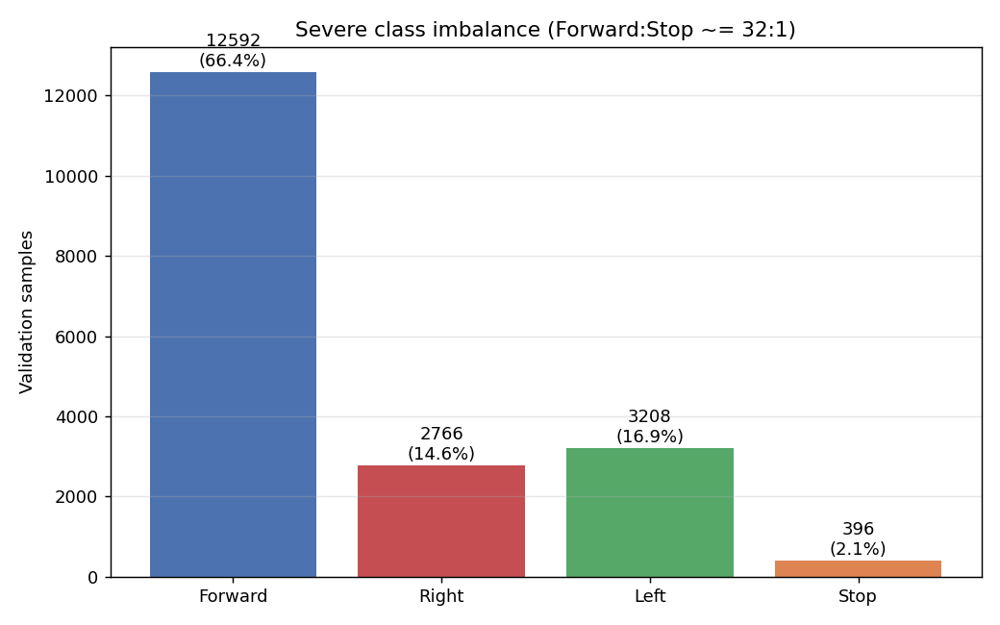

그림 7-2. [모델1] 검증셋 행동 분포 — 전진 66.4% vs 정지 2.1%(약 32:1)의 심한 불균형이 구조적 전진 편향의 근본 원인

## 8. 과제 안내 대비 변경·추가 사항

- 클래스 균형 재샘플링 도입: 명세에는 없으나 전진 67% 편향으로 인한 '항상 전진' 붕괴를 막기 위해 epoch마다 균형 재샘플링(power=0.7)을 적용했습니다.
- best 체크포인트 선택 기준 변경: overall accuracy는 전진만 맞혀도 67%가 나와 오해를 부르므로, macro per-class accuracy로 best를 선택했습니다.
- 본학습 전 자동 점검과 학습 재개 기능 구현: loss 마스킹·LoRA 부착·VRAM 안전 배치·체크포인트 재현 등 10개 항목을 미리 점검(전부 통과)하고, 중단되면 이어서 학습하도록 만들었습니다.
- RGB가 mp4가 아닌 rgb.npy 형태라 전용 로더를 구현했고, episode_id의 scan 접두사를 제거해 하위 폴더를 매핑했습니다.
- 실험을 빠르게 비교하기 위한 소규모 실험 구조와, 결과를 표·그래프로 자동 정리하는 보고서 생성 스크립트를 만들었습니다.
- 본학습 중 1시간마다 상태를 점검해 이상 발생 시 휴대폰으로 카카오톡 알림을 보내는 안전점검 에이전트를 함께 운영했습니다.
- 학습 실패 위험을 분산하기 위해 모델을 두 갈래로 나눠 서로 다른 전략으로 병행 학습하고 결과를 비교했습니다.

### 8-2. (가점) Image + Text → velocity 확장 (모델1)

Week 3의 Text→velocity 모델을 Image+Text→velocity로 확장했습니다. SigLIP2의 비전·텍스트 인코더는 모두 동결하고 MLP head만 학습해 Week 3의 방식을 유지했습니다. text / image / image+text 세 가지를 비교해 이미지의 기여를 직접 측정했습니다.

| modality | val MSE | 행동 정확도 | per-class F/R/L/Stop |
| --- | --- | --- | --- |
| text (instruction only) | 0.324 | 6.1% | 4 / 0 / 1 / 92 |
| image only | 0.268 | 36.0% | 39 / 38 / 30 / 44 |
| image + text | 0.324 | 33.8% | 32 / 37 / 31 / 44 |

instruction은 한 에피소드 안에서 모든 timestep에 동일하므로, 텍스트만으로는 '지금 어느 스텝인지'를 구분할 수 없어 거의 정지만 예측했습니다(6.1%). 반면 이미지 한 장만으로는 네 행동을 고르게 구분해(36.0%) 내비게이션 신호가 주로 이미지에 있음을 확인했습니다. 프레임 한 장과 작은 MLP라는 한계로 절대 정확도는 높지 않지만, image가 text보다 신호를 많이 담는다는 상대 비교가 이 실험의 결론입니다.

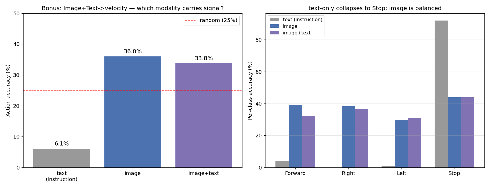

그림 8-1. (가점) text / image / image+text 행동 정확도와 클래스 분포 — 신호는 주로 이미지(6.1% → 36.0%)

## 9. 한계 및 향후 과제

이 접근은 GPS나 지도, 객체 좌표 없이 1인칭 카메라와 자연어 지시만으로 동작하는 부분 관찰 문제입니다. 보이는 것만으로 판단하므로 일반성은 높지만, 그만큼 다음 한계가 있습니다.

- 부분 관찰: 시야 밖이나 가려진 곳, 멀리 있는 목표는 인지할 수 없어, 화면에 없는 목표는 적극적 탐색 없이는 찾기 어렵습니다.
- 지도·장기 메모리 부재: 한 번 지나친 곳을 기억하지 못해 같은 자리를 맴돌거나 막다른 길을 반복할 수 있습니다.
- 누적 오차: closed-loop 특성상 한 번의 오판이 이후 관찰을 바꿔 오차가 커집니다(분포 시프트).
- 이산·고정 행동과 정지 판단의 어려움: 25cm·15° 고정 행동은 미세 제어에 불리하고, 정지는 도착 판단의 문맥 의존성이 커 가장 어렵습니다.
- 향후 과제: 공간 메모리/맵, 모델 자기 궤적으로 재학습하는 on-policy 보정(DAgger), 지시문 단계 추적(progress monitor), depth 활용과 연속 행동, sim2real 보정을 고려할 수 있습니다.

## 부록. 팀 구성 및 역할 분담

학생별 담당 부분을 표로 정리했습니다.

| 이름 | 담당 파트 |
| --- | --- |
| 박성현 | 본 모델 핵심 학습 · 학습 파이프라인 구성 |
| 김주영 | 병행 학습(균형형 비교 실험) · 최종 보고서 작성 |
| 변민석 | 발표 진행 · 자료 조사 및 배경 정리 |
| 한준태 | 발표자료 수집 · 질의응답 정리 |
